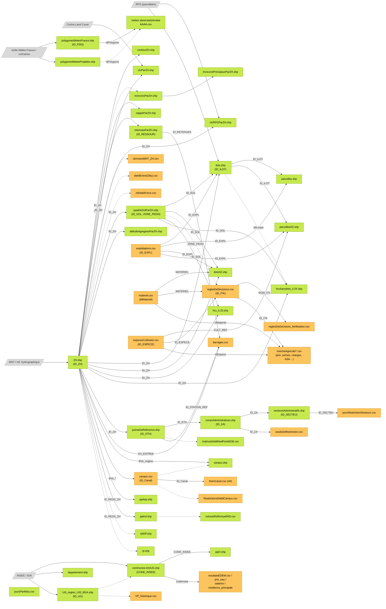

# Dépendances entre les fichiers d'entrée MAELIA

> **Objet :** cartographier comment on passe des **fichiers de base** (orange dans les organigrammes,
> `generation: MANUAL` dans `maelia-database.json`) aux **fichiers générés automatiquement**
> (vert dans les organigrammes, `generation: AUTO`) par le **module de prétraitement**.
> Ces fichiers `AUTO` ne sont **pas produits par MAELIA** : ils sont produits en amont par le
> prétraitement, puis consommés par MAELIA comme le reste des entrées.
>
> **Sources :** `OrganigrammeAll.png` + organigrammes par modèle, `maelia-database.json`
> (dérivé de `MAELIA_Schema_Donnees.xlsx`, grounding SASSEME V1).

---

## 1. Principe de lecture

Deux types de dépendances sont documentés :

| Type | Définition | Source d'information |
|------|------------|----------------------|
| **Dépendance par identifiant (FK)** | Le fichier A contient une colonne qui référence la clé d'un fichier B (`referencesDataSpec` dans le JSON). B doit exister et être cohérent **avant** de produire/valider A. | `maelia-database.json` |
| **Dépendance implicite (par construction)** | Le fichier est découpé/agrégé « par ZH », « par UG », etc. — la dépendance existe même sans colonne documentée (fichiers `*ParZH.shp`, `contourZH.shp`, …). | nommage + organigrammes |

Le sens des flèches dans tout ce document : **`source ──> fichier qui en dépend`**
(il faut la source pour obtenir/générer la cible).

### Clés définies et clés référencées

| Fichier (clé primaire) | Clé définie | Référencée par (colonne) |
|---|---|---|
| `ZH.shp` | `ID_ZH` | `ID_ZH`, `ID_RESS_ZH`, `ZH_ENTREE`, `BVe_origine`, `BVeAvantObs`, `BVe_retourX` |
| `typeDeSolParZH.shp` | `ID_SOL` (+ `ZONE_PEDO`) | `ID_SOL` |
| `polygonesMeteoFrance.shp` | `ID_PDG` | `idPolygone` |
| `communes-trimUG.shp` | `CODE_INSEE` | `CODE_INSEE`, `codeInsee` |
| `exploitations.csv` | `ID_EXPL` | `ID_EXPL` |
| `materiel.csv` | `idMateriel` | `MATERIEL`, `idMateriel` |
| `especesCultivees.csv` | `ID_ESPECE` | `ID_ESPECE`, `idEspece`, `CULT_REF` |
| `reglesDeDecisions.csv` | `ID_ITK` | `ID_ITK`, `FERTIALT_NOM_ITK` |
| `ilots.shp` | `ID_ILOT` | `ID_ILOT` |
| `pointsDeReference.shp` | `ID_STH` | `ID_STH`, `ID_STATION_REF` |
| `zonesAdministratives.shp` | `ID_ZA` | `ID_ZA` |
| `secteursAdministratifs.shp` | `ID_SECTEU` | `ID_SECTEU` |
| `retenuesParZH.shp` | `ID_RESSOUR` | `ID_RETENUES` |
| `canaux.csv` | `ID_Canal` | `ID_Canal` |

> **`ZH.shp` est le pivot de toute la base** : 14 fichiers en dépendent directement via `ID_ZH`,
> et la quasi-totalité des fichiers `*ParZH` en dépendent implicitement.

---

## 2. Inventaire — fichiers générés (verts / `AUTO`) et leurs entrées

Pour chaque fichier généré par le prétraitement : ce qu'il faut avoir avant de le produire.
*(implicite)* = dépendance par construction, non portée par une colonne documentée.

### Modèle commun

| Fichier généré | Dépend de | Via |
|---|---|---|
| `ZH.shp` | MNT / référentiel hydrographique *(source externe)* — lié à `donneesMNT_ZH.csv` (base) | racine du graphe |
| `typeDeSolParZH.shp` | `ZH.shp` | `ID_ZH` |
| `polygonesMeteoFrance.shp` | grille Météo-France *(source externe)* | racine |
| `polygonesMeteoProjettes.shp` | scénarios climatiques *(source externe)* | racine (requis si scénario climatique) |
| `meteo/observee/AAAA.csv` (1/an) | `polygonesMeteoFrance.shp` | `idPolygone` → `ID_PDG` |
| `meteo/simulee/<scenario>/AAAA.csv` | `polygonesMeteoProjettes.shp` | `idPolygone` → `ID_PDG` |
| `joursParMois.csv` | — (calendrier statique) | racine |
| `communes-trimUG.shp` | INSEE/IGN *(externe)* + `UG_region_L93_BGA.shp` *(implicite : découpage sur l'UG)* | géométrie |
| `departement.shp` | INSEE/IGN *(externe)* | racine |
| `altitudeAgregeesParZH.shp` | `ZH.shp` + MNT *(implicite)* | `ID_ZH` |

### Modèle agricole

| Fichier généré | Dépend de | Via |
|---|---|---|
| `ilots.shp` (dansZone) | `exploitations.csv` **(base)**, `typeDeSolParZH.shp`, `ZH.shp` + RPG *(externe)* | `ID_EXPL`, `ID_SOL`, `ID_ZH` |
| `parcelles.shp` (dansZone) | `ilots.shp`, `exploitations.csv` **(base)** | `ID_ILOT`, `ID_EXPL` |
| `ilotsHZ.shp` (horsZone) | `exploitations.csv` **(base)**, `typeDeSolParZH.shp`, `ZH.shp`, `materiel.csv` **(base)** | `ID_EXPL`, `ID_SOL`, `ID_ZH`, `MATERIEL` |
| `parcellesHZ.shp` (horsZone) | `ilots(HZ).shp`, `exploitations.csv` **(base)**, `especesCultivees.csv` **(base)** | `ID_ILOT`, `ID_EXPL`, `CULT_REF` |

### Modèle normatif

| Fichier généré | Dépend de | Via |
|---|---|---|
| `UG_region_L93_BGA.shp` | référentiel administratif *(externe)* | racine |
| `pointsDeReference.shp` | `ZH.shp` | `ID_ZH` |
| `zonesAdministratives.shp` | `pointsDeReference.shp` | `ID_STH` |
| `secteursAdministratifs.shp` | `zonesAdministratives.shp` | `ID_ZA` |
| `matriceDebitReelPointDOE.csv` | `pointsDeReference.shp` *(implicite — champs PENDING)* | points DOE |

### Modèle hydrographique

| Fichier généré | Dépend de | Via |
|---|---|---|
| `contourZH.shp` | `ZH.shp` *(implicite : contour de la zone)* | géométrie |
| `tronconsParZH.shp` | `ZH.shp` *(implicite)* + réseau hydro *(externe)* | découpage par ZH |
| `tronconsPrincipauxParZH.shp` | `tronconsParZH.shp` / `ZH.shp` *(implicite)* | sélection |
| `hru_0.25.shp` | `ZH.shp`, `typeDeSolParZH.shp` + occupation du sol *(implicite CLC)* | `ID_ZH`, `ID_SOL` |
| `hruSansIlots_0.25.shp` | `ZH.shp`, `typeDeSolParZH.shp` + `ilots.shp` *(implicite : HRU – îlots)* | `ID_ZH`, `ID_SOL` |
| `nappeParZH.shp` | `ZH.shp` | `ID_ZH` |
| `retenuesParZH.shp` | `ZH.shp` | `ID_ZH` |
| `clcParZH.shp` | `ZH.shp` + Corine Land Cover *(externe)* | `ID_ZH` |
| `clcRPGParZH.shp` | `ZH.shp` + CLC + RPG *(externe)* | `ID_ZH` |
| `canaux.shp` | `ZH.shp` (+ `canaux.csv` **(base)** *(implicite : mêmes canaux)*) | `BVe_origine` |
| `ppIrr.shp` | `communes-trimUG.shp` | `CODE_INSEE` |
| `ppAep.shp` | `ZH.shp` | `ID_RESS_ZH` |
| `ppInd.shp` | `ZH.shp` | `ID_RESS_ZH` |
| `volumeRefAnnuelIND.csv` | `ppInd.shp` *(implicite — champs PENDING)* | équipements IND |
| `rjAEP.shp` | `ZH.shp` *(implicite — champs PENDING)* | rejets AEP |
| `rjI.shp` | `ZH.shp` *(implicite — champs PENDING)* | rejets industriels |

---

## 3. Fichiers de base (oranges / `MANUAL`) et leurs références croisées

Les fichiers de base sont saisis/importés manuellement. Certains référencent d'autres fichiers
(y compris des fichiers générés) — la cohérence des identifiants doit être maintenue :

| Fichier de base | Référence | Via |
|---|---|---|
| `exploitations.csv` | — (définit `ID_EXPL`) | racine |
| `materiel.csv` | — (définit `idMateriel`) | racine |
| `especesCultivees.csv` | — (définit `ID_ESPECE`) | racine |
| `reglesDeDecisions.csv` | `especesCultivees.csv`, `materiel.csv`, `typeDeSolParZH.shp` *(implicite via `ZONE_PEDO`)* | `ID_ESPECE`, `MATERIEL`, `ZONE_PEDO` |
| `reglesDeDecisions_fertilisation.csv` | `reglesDeDecisions.csv` | `FERTIALT_NOM_ITK` |
| `Engrais.csv` | — | racine |
| `prixVentes(ID).csv`, `primes.csv` | `especesCultivees.csv` | `idEspece` |
| `chargesOp.csv`, `chargesDePassage.csv` | `reglesDeDecisions.csv` | `ID_ITK` |
| `chargesFixesMaterielIrrigation.csv` | `materiel.csv` | `idMateriel` |
| `ASAForfaitDebit/Surface/PrixEau.csv` | — (définissent `idASA`) | racine |
| `seuilsDeRestriction.csv` | `zonesAdministratives.shp` **(généré)** | `ID_ZA` |
| `joursRestrictionSecteurs.csv` | `secteursAdministratifs.shp` **(généré)** | `ID_SECTEU` |
| `barrages.csv` | `pointsDeReference.shp` **(généré)**, `ZH.shp` **(généré)**, `retenuesParZH.shp` **(généré)** | `ID_STATION_REF`, `ZH_ENTREE`, `ID_RETENUES` |
| `canaux.csv` | `ZH.shp` **(généré)** | `BVe_origine`, `BVeAvantObs`, `BVe_retourX` |
| `NomCanal.csv` (1/canal) | `canaux.csv` | `ID_Canal` |
| `RestrictionsDebitCanaux.csv` | `canaux.csv` *(implicite)* | canaux |
| `donneesMNT_ZH.csv` | `ZH.shp` *(implicite : données MNT par ZH)* | par ZH |
| `debitEntre.csv`, `debitEntreObs.csv`, `zhDebitForce.csv` | `ZH.shp` *(implicite)* | par ZH |
| `resultatsEDEM.csv`, `prix_eau_maelia_complet.csv`, `salaires_maelia-complet.csv`, `residence_principale_maelia-complet.csv` | `communes-trimUG.shp` **(généré)** | `codeInsee` |
| `VP_historique.csv` | `UG_region_L93_BGA.shp` *(implicite)* | par UG |
| `profilesAgriculteurs.csv`, `perceptionAgriculteurs.csv`, `systemesDeCultureDeReference.csv`, `matriceDistanceCulturale.csv` | fichiers culture/agriculteurs *(fonctions de croyance)* | profils/SDC |

---

## 4. Schéma global des dépendances

Vert = généré par le prétraitement (`AUTO`) · Orange = fichier de base (`MANUAL`) · Gris = source externe.

Flèches pleines = dépendance par identifiant documentée · flèches pointillées = dépendance implicite.

---

## 5. Ordre de génération (tri topologique)

Ordre dans lequel le module de prétraitement doit produire les fichiers verts,
en partant des sources externes et des fichiers de base :

| Niveau | Fichiers | Prérequis |
|---|---|---|
| **0 — Racines générées** | `ZH.shp`, `polygonesMeteoFrance.shp`, `polygonesMeteoProjettes.shp`, `UG_region_L93_BGA.shp`, `joursParMois.csv`, `departement.shp` | uniquement sources externes (MNT, Météo-France, INSEE/IGN) |
| **0 — Bases saisies** | `exploitations.csv`, `materiel.csv`, `especesCultivees.csv`, `Engrais.csv`, `donneesMNT_ZH.csv`, fichiers marché/ASA, etc. | saisie manuelle / import |
| **1** | `typeDeSolParZH.shp`, `contourZH.shp`, `altitudeAgregeesParZH.shp`, `tronconsParZH.shp`, `nappeParZH.shp`, `retenuesParZH.shp`, `clcParZH.shp`, `clcRPGParZH.shp`, `pointsDeReference.shp`, `canaux.shp`, `ppAep.shp`, `ppInd.shp`, `rjAEP.shp`, `rjI.shp`, `AAAA.csv` (météo), `communes-trimUG.shp` | `ZH.shp` (ID_ZH) ; `polygonesMeteo*` ; `UG` |
| **2** | `ilots.shp` / `ilotsHZ.shp`, `hru_0.25.shp`, `zonesAdministratives.shp`, `tronconsPrincipauxParZH.shp`, `ppIrr.shp`, `volumeRefAnnuelIND.csv`, `matriceDebitReelPointDOE.csv` | niveau 1 + `exploitations.csv`, `materiel.csv` |
| **3** | `parcelles.shp` / `parcellesHZ.shp`, `hruSansIlots_0.25.shp`, `secteursAdministratifs.shp` | `ilots.shp`, `zonesAdministratives.shp`, `especesCultivees.csv` |
| **4 — Bases dépendantes** | `reglesDeDecisions.csv` → `reglesDeDecisions_fertilisation.csv`, `seuilsDeRestriction.csv`, `joursRestrictionSecteurs.csv`, `barrages.csv`, `canaux.csv` → `NomCanal.csv`, fichiers communes (EDEM, prix eau…) | les identifiants des niveaux précédents doivent exister |

> Les fichiers de base du niveau 4 ne sont pas « générés », mais leur **saisie n'est valide
> qu'après** génération des fichiers dont ils référencent les identifiants
> (ex. `seuilsDeRestriction.csv` a besoin des `ID_ZA` de `zonesAdministratives.shp`).

---

## 6. Chaînes de dépendances remarquables

- **Chaîne sol → parcellaire :** `MNT → ZH.shp → typeDeSolParZH.shp → ilots.shp → parcelles.shp`
  (avec `exploitations.csv` injecté au niveau des îlots). C'est la chaîne la plus longue côté agricole.
- **Chaîne normative :** `ZH.shp → pointsDeReference.shp → zonesAdministratives.shp → secteursAdministratifs.shp`,
  puis les fichiers de restriction (base) se branchent sur `ID_ZA` / `ID_SECTEU`.
- **Chaîne météo :** `polygonesMeteoFrance.shp → observee/AAAA.csv` et
  `polygonesMeteoProjettes.shp → simulee/<scenario>/AAAA.csv` via `idPolygone`.
- **Chaîne usages (AEP) :** `UG → communes-trimUG.shp → ppIrr.shp` + fichiers communes
  (`resultatsEDEM`, `prix_eau`, `salaires`, `residence_principale`) joints par `codeInsee`.
- **Couplage agricole↔hydro :** `hruSansIlots_0.25.shp` = HRU **moins** les îlots agricoles ;
  il dépend donc de `ilots.shp` en plus de `ZH.shp`/`typeDeSolParZH.shp` (mode `module.agricole == true`).

## 7. Notes et limites

- La classification vert/orange des organigrammes correspond exactement au champ
  `generation` (`AUTO`/`MANUAL`) de `maelia-database.json` — aucune divergence constatée.
- 14 fichiers sont `PENDING` (champs non documentés dans le JSON) : leurs dépendances marquées
  *(implicite)* sont déduites du nommage et des organigrammes, à confirmer
  (`tronconsParZH`, `volumeRefAnnuelIND`, `rjAEP`, `rjI`, `matriceDebitReelPointDOE`, …).
- Le JSON ne trace pas les **sources externes brutes** (MNT, RPG, CLC, SAFRAN…) ; elles sont
  déduites des descriptions et représentées en gris dans le schéma.
- Écarts de nommage organigrammes vs JSON (déjà relevés dans `analyse_json_vs_maelia.md`) :
  `pplrr.shp`→`ppIrr.shp`, `N x prixVentes(ID).csv`→`prixVentes(ID).csv`, etc.
