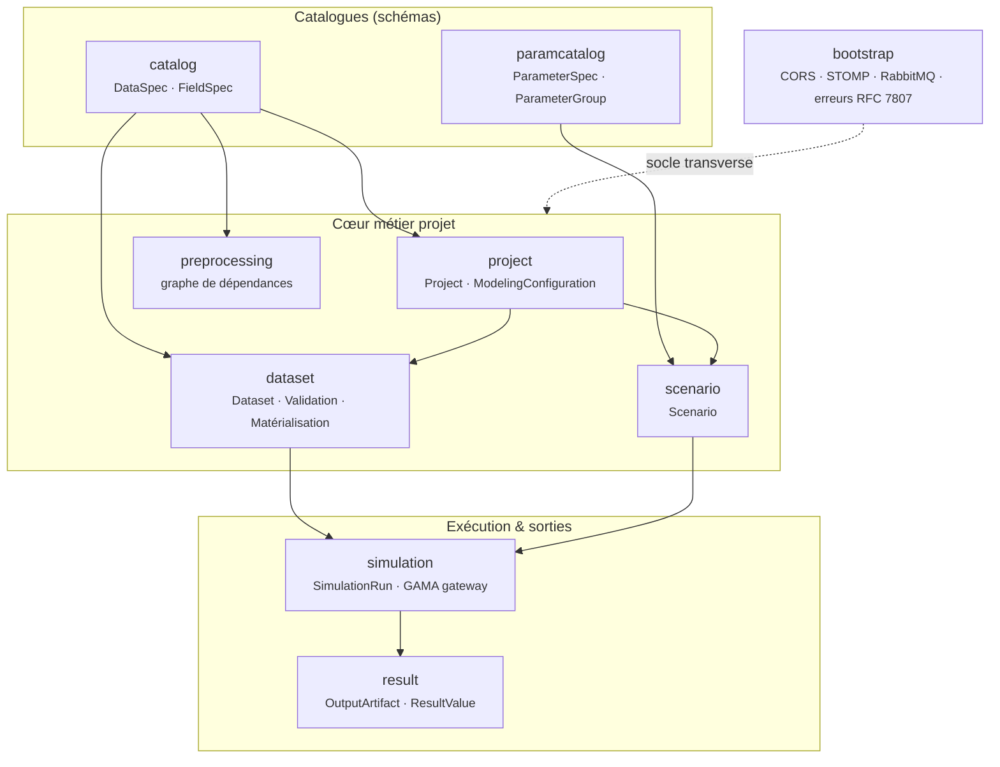
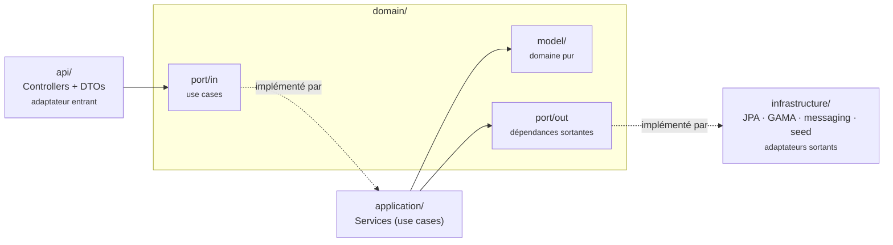
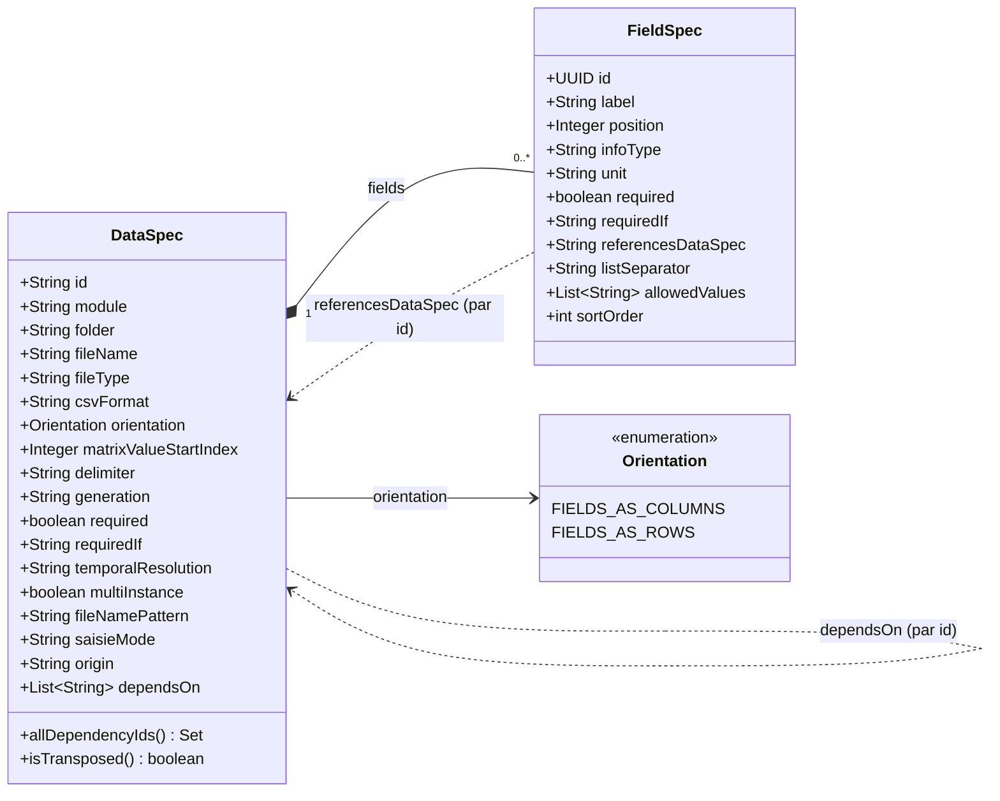
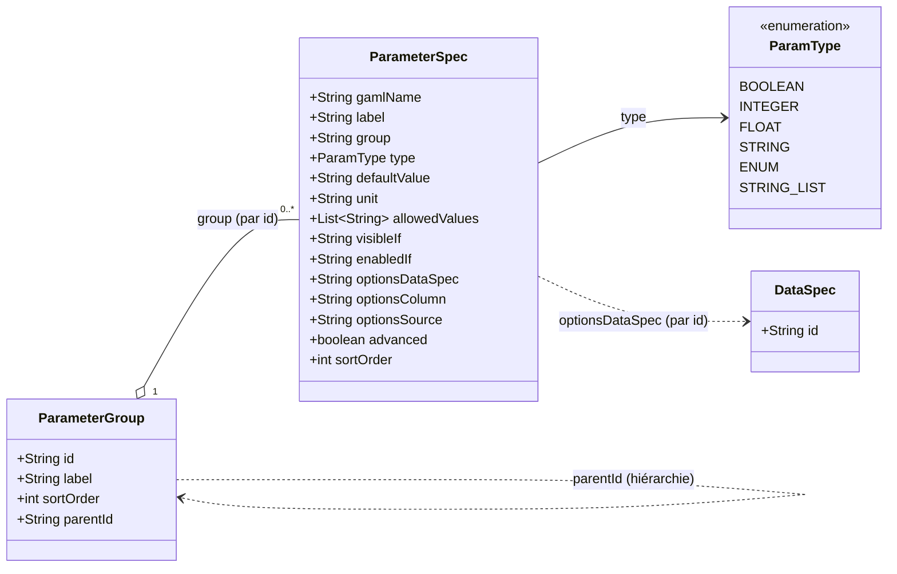
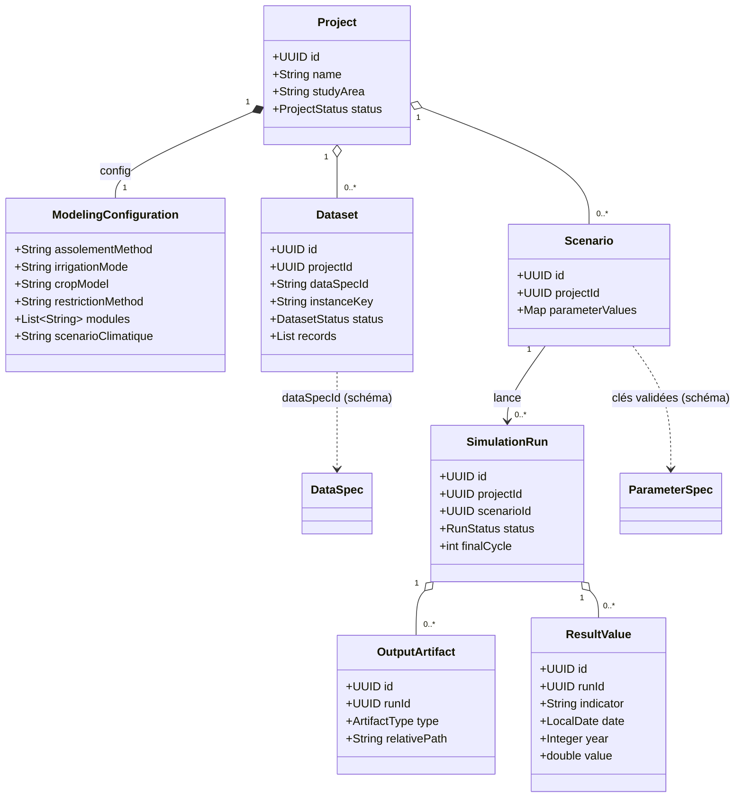
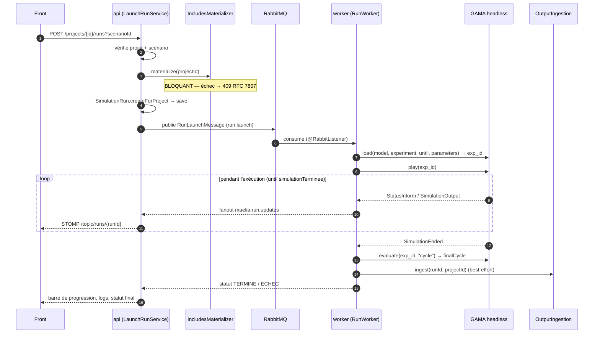

# Architecture backend

Le backend (`maelia-server/`) est écrit en **Java 21 / Spring Boot 3.3.6**. Le code est
découpé **par contexte métier** (bounded context), pas par couche globale. Package racine :
`sn.lhacksrt.maeliaserver`.

## Carte des contextes

Neuf contextes collaborent, du catalogue (schémas) jusqu'à la restitution des résultats. Les
flèches indiquent le sens des dépendances applicatives (appels de ports).

!!! info "Contexte `iam`"
    L'authentification (rôles ADMIN / MODELISATEUR / OBSERVATEUR) est prévue mais **non
    implémentée** (jalon M9, en dernier).

## Structure hexagonale d'un contexte

Chaque contexte suit la même structure : les dépendances pointent **vers l'intérieur** — le
domaine ne connaît ni Spring ni JPA.

!!! note "Communication inter-contextes"
    Elle passe par les ports : par exemple `RunWorker` (contexte `simulation`) appelle
    `IngestOutputsUseCase` du contexte `result`. Chaque tranche expose ses use cases entrants et
    consomme les autres via leurs ports, jamais via leurs classes internes.

## Les 9 contextes métier

| Contexte | Responsabilité |
|---|---|
| `bootstrap` | Socle transverse : `WebConfig` (CORS), `StompConfig` (WS `/ws`), `RabbitMqConfig`, `GlobalExceptionHandler` (RFC 7807), `HealthController` |
| `catalog` | Catalogue des types de données d'entrée : `DataSpec` / `FieldSpec` / `Orientation`, `RequiredIfEvaluator`, seed `maelia-database.json` (71 types), CRUD admin |
| `project` | Projets et configuration de modélisation : `Project`, `ModelingConfiguration` (JSONB), calcul de complétude |
| `dataset` | Saisie / import / validation / matérialisation : `Dataset`, `ValidationEngine`, `CsvImportService`, `ShpUploadService`, `BulkImportService`, `IncludesMaterializer` |
| `paramcatalog` | Catalogue des paramètres de simulation : `ParameterSpec` (142) / `ParameterGroup` (16), seed idempotent, CRUD admin |
| `scenario` | Scénarios : `Scenario.parameterValues` (uniquement les écarts aux défauts), `GamaParameterBuilder` |
| `simulation` | Orchestration des runs : `SimulationRun` / `RunStatus`, `LaunchRunService`, adaptateur GAMA, `RunWorker`, `RunUpdateRelay` |
| `result` | Ingestion & restitution des sorties : `OutputArtifact` / `ResultValue`, `OutputIngestionService`, `CsvSeriesParser`, `ArtifactStorage` |
| `preprocessing` | Dépendances entre fichiers d'entrée : `DependencyGraphBuilder`, `PreprocessingService` (plan DONE/READY/BLOCKED) |

## Métamodèle du catalogue de données

Le catalogue décrit **comment** chaque fichier d'entrée MAELIA est structuré, sans coder en dur
aucun fichier. Un `DataSpec` (un type de fichier) agrège des `FieldSpec` (ses colonnes/champs).

**Points clés du métamodèle :**

- **`Orientation`** — `FIELDS_AS_COLUMNS` (standard : un champ = une colonne, un enregistrement =
  une ligne) ou `FIELDS_AS_ROWS` (transposé, ex. `reglesDeDecisions.csv` : chaque champ est une
  ligne, chaque enregistrement une colonne à partir de `matrixValueStartIndex`).
- **`multiInstance` + `fileNamePattern`** — un même type couvre plusieurs fichiers instanciés
  (ex. `serieClimatique` reconnaît `2018.csv`, `2019.csv`… via le pattern `\d{4}\.csv`).
- **`saisieMode`** — pilote le rendu côté frontend (`GRID` / `MAP` / `IMPORT`).
- **`FieldSpec.referencesDataSpec`** — référence par identifiant vers un autre `DataSpec`
  (intégrité + sélecteurs référentiels).
- **`DataSpec.dependsOn`** — dépendances implicites « par construction » (V16), stockées
  `|`-séparées. `allDependencyIds()` fusionne les deux sources (références de champs + `dependsOn`),
  socle du graphe de prétraitement.
- **`origin`** — `SEED` (issu de `maelia-database.json`) ou `USER` (créé via le CRUD admin).

## Métamodèle des paramètres de scénario

Symétrique du catalogue de données, ce catalogue décrit les **142 paramètres** du launcher MAELIA,
extraits de `launcherBase.gaml`, regroupés en **16 sections** (`ParameterGroup`).

**Points clés du métamodèle :**

- **`ParamType`** — coercition de `defaultValue` (conservé en texte, listes jointes par `|`) :
  `BOOLEAN`, `INTEGER`, `FLOAT`, `STRING`, `ENUM`, `STRING_LIST`.
- **`visibleIf` / `enabledIf`** — même grammaire : `visibleIf` masque le champ, `enabledIf`
  l'affiche mais le désactive (dépendances entre paramètres, ex. un id saisissable uniquement si
  « simulationSurX » est coché).
- **`optionsDataSpec` / `optionsColumn` / `optionsSource`** — **pont entre les deux catalogues** :
  les valeurs proposées pour un paramètre sont tirées d'un dataset du projet. `optionsSource` vaut
  `COLUMN` (valeurs distinctes d'une colonne), `COLUMN_HEADERS` (noms de colonnes) ou
  `INSTANCE_KEYS` (clés d'un `DataSpec` multi-instance).
- **`advanced`** — masque le paramètre derrière un dépliage « avancé » dans le formulaire.

!!! tip "Un moteur, deux catalogues"
    `DataSpec`/`FieldSpec` et `ParameterGroup`/`ParameterSpec` sont deux déclinaisons du même
    principe : décrire par un schéma ce qui varie, pour qu'un **moteur de formulaires générique**
    (côté frontend) et des **codecs génériques** (côté backend) les traitent sans code spécifique.

## Modèle de domaine du workflow

Comment les schémas s'incarnent en données concrètes d'un projet, jusqu'aux résultats d'un run.

- **`Dataset`** — instance concrète d'un `DataSpec` pour un projet (`records` = liste de maps
  JSONB) ; `instanceKey` distingue les fichiers d'un type multi-instance. Statuts : `VIDE`,
  `EN_COURS`, `VALIDE`, `INVALIDE`.
- **`Scenario.parameterValues`** — **uniquement les écarts aux défauts** du launcher, validés contre
  le `ParameterSpec` (clés connues + ENUM).
- **`SimulationRun`** — statuts `EN_FILE`, `EN_COURS`, `TERMINE`, `ECHEC`, `ANNULE`.
- **`OutputArtifact`** (`IMAGE`/`CSV`/`XML`/`OTHER`) et **`ResultValue`** (séries indicateur × zone ×
  date/cycle/année) sont produits par l'ingestion des sorties.

## Profils Spring

Le fichier `application.yml` est multi-documents :

| Profil | Usage |
|---|---|
| *(base)* | Datasource Postgres, Flyway, RabbitMQ, MinIO, config `gama.*` / `maelia.*`, multipart 200 MB, Actuator |
| `api` | Serveur web 8080, REST + STOMP ; consomme la file fanout des mises à jour pour les relayer en STOMP |
| `worker` | Pas de serveur web ; listener AMQP `concurrency: 2` / `max-concurrency: 4` / `prefetch: 1` |
| `dev` | Logs SQL verbeux |
| `test` | Désactive DataSource / JPA / Flyway / AMQP (les tests unitaires purs passent sans infra) |

## Flux d'exécution d'un run

### Paramètres pilotés par le système

En plus des écarts du scénario, `GamaParameterBuilder` impose des paramètres qui priment :
`executerSurCluster=false`, `cheminRacineMaelia={mount}/maelia/`,
`cheminModeleVersDonnees={mount}/maelia/projects/{id}/includes/`, `idSimulationAPI={runId}`,
`nomSimulation={runId[0..8]}`. Chaque entrée est sérialisée en `{type:"parameter", name, value}`.

### Protocole GAMA server

JSON sur WebSocket : `load {model, experiment, until, parameters, status, console, runtime}` →
réponse portant l'`exp_id` ; `play {exp_id}` ; `stop {exp_id}` ; `expression {exp_id, expr}`.
La fin est détectée par le message `SimulationEnded` (l'expérience expose `until: simulationTerminee`).

## Persistance

Migrations **Flyway V1 → V16** (PostgreSQL 16 + PostGIS 3.4). Les structures variables
(`ModelingConfiguration`, enregistrements de `Dataset`, `Scenario.parameterValues`) sont stockées
en **JSONB** via hypersistence-utils.
