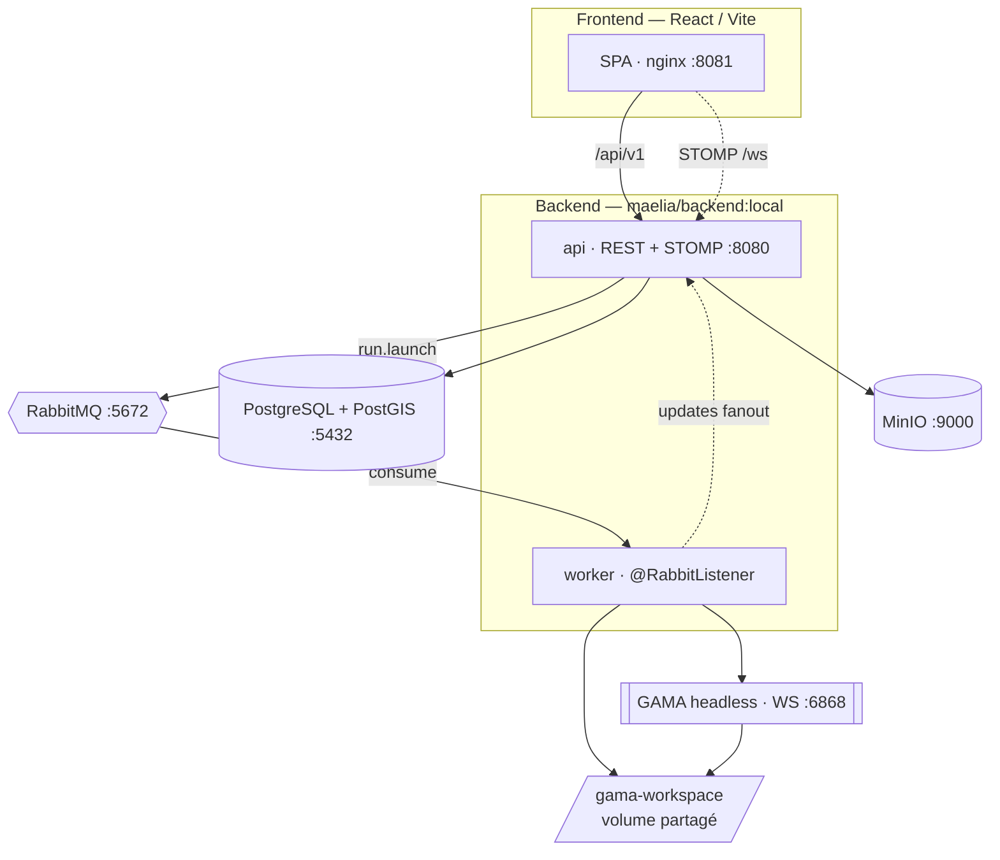

# Architecture — vue d'ensemble

La plateforme est composée d'un **backend** Java/Spring (architecture hexagonale par contexte
métier), d'un **frontend** React (Feature-Sliced Design), et d'une infrastructure Docker
Compose orchestrant la base de données, la messagerie, le stockage objet et le moteur GAMA.

## Les deux flux essentiels

=== "Lancement d'un run"

    L'`api` matérialise les includes, crée le `SimulationRun`, puis publie un message sur
    RabbitMQ. Le `worker` le consomme, ouvre une session WebSocket persistante vers GAMA,
    charge et joue l'expérience, puis ingère les sorties.

=== "Temps réel"

    Les messages émis par GAMA (statut, sorties, fin, erreur) sont republiés sur un échange
    **fanout** RabbitMQ. L'`api` s'y abonne et relaie chaque message en **STOMP** sur
    `/topic/runs/{runId}`, que le frontend écoute pour animer le moniteur de run.

## Principe transversal

!!! tip "La base de données est la source de vérité"
    Les fichiers d'entrée GAMA ne sont jamais édités directement : ils sont **régénérés à la
    demande** à partir de la base (« matérialisation des includes »). De même, tout ce qui est
    variable — types de données, paramètres de simulation — est décrit par des **catalogues de
    schémas**, jamais codé en dur.

Poursuivez avec le détail de chaque couche :

- [Architecture backend](backend.md) — hexagonale, 9 contextes métier
- [Architecture frontend](frontend.md) — Feature-Sliced Design, moteur de formulaires par schéma
