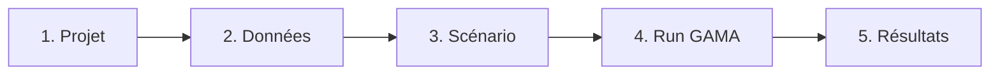

# Guide d'utilisation

Le parcours type dans la plateforme suit cinq étapes, du projet à la lecture des résultats.
Chaque étape correspond à une section de l'espace projet dans le frontend.

## 1. Créer et configurer un projet

Depuis la **liste des projets**, créez un projet sur un territoire, puis renseignez sa
**configuration de modélisation** (`ModelingConfiguration`). Cette configuration détermine
quels fichiers de données du catalogue sont **applicables** au projet.

L'espace projet affiche un **tableau de complétude** qui croise les `DataSpec` applicables avec
les datasets existants pour visualiser l'avancement de la saisie.

## 2. Saisir ou importer les données d'entrée

Les données d'entrée (~70 fichiers CSV/SHP) sont décrites par le catalogue `DataSpec` / `FieldSpec`.
Plusieurs modes de saisie coexistent :

- **Grille** — saisie manuelle ligne à ligne (priorité à la facilité de saisie) ;
- **Import CSV** — upload d'un fichier, mapping des colonnes, validation ;
- **Upload shapefile** — zip `.shp`/`.shx`/`.dbf` stocké dans MinIO ;
- **Initialisation en masse** — un ZIP de CSV + shapefiles appariés au catalogue par nom de fichier.

!!! info "Validation à deux niveaux"
    Le `ValidationEngine` vérifie **(1)** la présence des champs requis, puis **(2)** le typage et
    les `allowedValues`. Un dataset ne devient `VALIDE` qu'après validation réussie.

Les fichiers marqués `generation=AUTO` ne sont **pas saisis manuellement** : ils sont produits
par un module de **prétraitement** amont (SIG), à partir des dépendances entre fichiers.

## 3. Configurer un scénario

Un **scénario** décrit les 142 paramètres du launcher MAELIA (catalogue `ParameterSpec` /
`ParameterGroup`). Le formulaire est **entièrement piloté par le schéma** : types
(BOOLEAN / INTEGER / FLOAT / ENUM / STRING / STRING_LIST), valeurs autorisées, visibilité
conditionnelle (`visibleIf`).

!!! tip "Seuls les écarts sont stockés"
    `Scenario.parameterValues` ne contient **que les écarts aux défauts** du launcher. Les
    paramètres non modifiés conservent leur valeur par défaut définie dans `launcherBase.gaml`.

## 4. Lancer une simulation et suivre sa progression

Le lancement d'un run déclenche la séquence suivante :

1. **Matérialisation des includes** — régénération des fichiers d'entrée du projet dans `gama-workspace/maelia/projects/{id}/includes/` (bloquant : un échec renvoie une erreur 409) ;
2. mise en file du run sur RabbitMQ ;
3. le **worker** ouvre une session WebSocket vers GAMA, charge le modèle, lance l'expérience et attend la fin ;
4. les messages GAMA sont relayés en **temps réel** via STOMP vers le **moniteur de run** (barre de progression, logs, statut) ;
5. à la fin, les sorties sont **ingérées** automatiquement (best-effort).

Statuts possibles : `EN_COURS`, `PROGRESS`, `LOG`, `ENDED`, `ERROR`, `TERMINE`, `ECHEC`.

## 5. Visualiser les résultats

Le **tableau de bord des résultats** restitue les sorties de GAMA :

- **séries temporelles** journalières (parsées depuis les CSV de sortie) ;
- **agrégat annuel** calculé par le backend ;
- **artefacts** téléchargeables (PNG / CSV / XML).

En cas de besoin, une **ré-ingestion** des sorties d'un run est possible via l'API
(`POST /runs/{runId}/ingest`).
